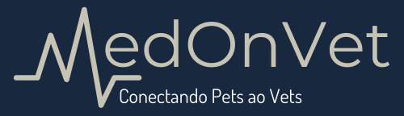

<h1 align="center">
    
    
</h1>
<h2 align="center">MedOnVet</h2>

Projeto de conclusão de curso feito com as linguagens python e javascript utilizando os frameworks django e react.

  

  
  
  

  
   

  

## 💻 Tabela de conteúdos

* [Sobre](#Sobre)
* [Tabela de Conteudo](#tabela-de-conteudo)
* [Tecnologias](#tecnologias)
* [Executar projeto](#executar-projeto)
    * [Pré-requisitos](#pré-requisitos)
    * [Execução](#execução)
    * [Ambiente Desenvolvimento](#Ambiente-Desenvolvimento)
    * [Testes](#Testes)
* [Endpoints](#endpoints)
